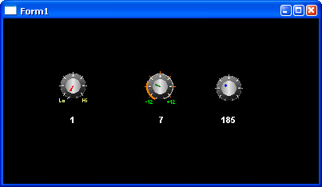



## Dial Control

### Description

This Control is useful for example for Musicans.

You can use it also as a Volume Meter etc.

Feel free to use it for your Projects.

You can change the Colors, you can use your own Graphic (any Size) you can edit many parameters (Radius, Style etc.)
 
### More Info
 

             |
---                |---
**Submitted On**   |2009-10-07 03:50:02
**By**             |[J\.Pfeffer](https://github.com/Planet-Source-Code/PSCIndex/blob/master/ByAuthor/j-pfeffer.md)
**Level**          |Advanced
**User Rating**    |5.0 (20 globes from 4 users)
**Compatibility**  |VB 6\.0
**Category**       |[Custom Controls/ Forms/  Menus](https://github.com/Planet-Source-Code/PSCIndex/blob/master/ByCategory/custom-controls-forms-menus__1-4.md)
**World**          |[Visual Basic](https://github.com/Planet-Source-Code/PSCIndex/blob/master/ByWorld/visual-basic.md)
**Archive File**   |[Dial\_Contr2164461072009\.zip](https://github.com/Planet-Source-Code/j-pfeffer-dial-control__1-72520/archive/master.zip)

